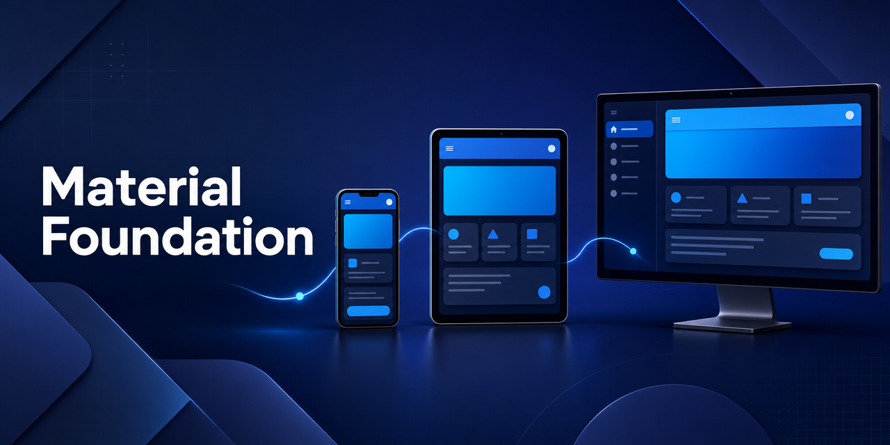

<p align="center">
  
</p>

<p align="center">
  Build responsive Flutter interfaces that automatically adapt across mobile, tablet, and desktop layouts.
</p>

<p align="center">
  <a href="https://github.com/DylanScottMickelson/material_foundation">
    
  </a>
  <a href="LICENSE">
    
  </a>
  <a href="https://github.com/sponsors/DylanScottMickelson">
    
  </a>
</p>

## 📂 Get Started

Add ```material_foundation``` as a dependency in your ```pubspec.yaml``` file:

```dart
dependencies:
  flutter:
    sdk: flutter

  material_foundation:
    git:
      url: https://github.com/DylanScottMickelson/material_foundation.git
```

Run ```flutter pub get``` to fetch the package and its dependencies.

## ✨ Usage

Import the Material Foundation library files into your Dart file:

```dart
import 'package:material_foundation/dynamic_scaffold.dart';
import 'package:material_foundation/dynamic_layout_builder.dart';
```


Create a new DynamicScaffold widget with the desired layouts for desktop, tablet, and mobile devices:

```dart
class _MyAppState extends State<MyApp> {
  @override
  Widget build(BuildContext context) {
    return MaterialApp(
      title: 'Material Foundation',
      theme: ThemeData(primarySwatch: Colors.blue),
      home:  DynamicScaffold(
          backgroundColor: Colors.white,
          desktopBody: DesktopBody(),
          tabletBody: TabletBody(),
          mobileBody: MobileBody(),
        ),
    );
  }
}
```

Create separate widgets for the desktop, tablet, and mobile layouts. These widgets will be displayed according to their respective screen sizes:

```dart
class DesktopBody extends StatelessWidget {
  @override
  Widget build(BuildContext context) {
    return Text('Desktop Body');
  }
}

class TabletBody extends StatelessWidget {
  @override
  Widget build(BuildContext context) {
    return Text('Tablet Body');
  }
}

class MobileBody extends StatelessWidget {
  @override
  Widget build(BuildContext context) {
    return Text('Mobile Body');
  }
}
```


## 🤗 Contributing
We welcome contributions from the community! If you'd like to contribute, please check out our contribution guidelines and submit a pull request with your changes.

## 📃 License
Material Foundation is released under the BSD-3 License. See LICENSE for details.
